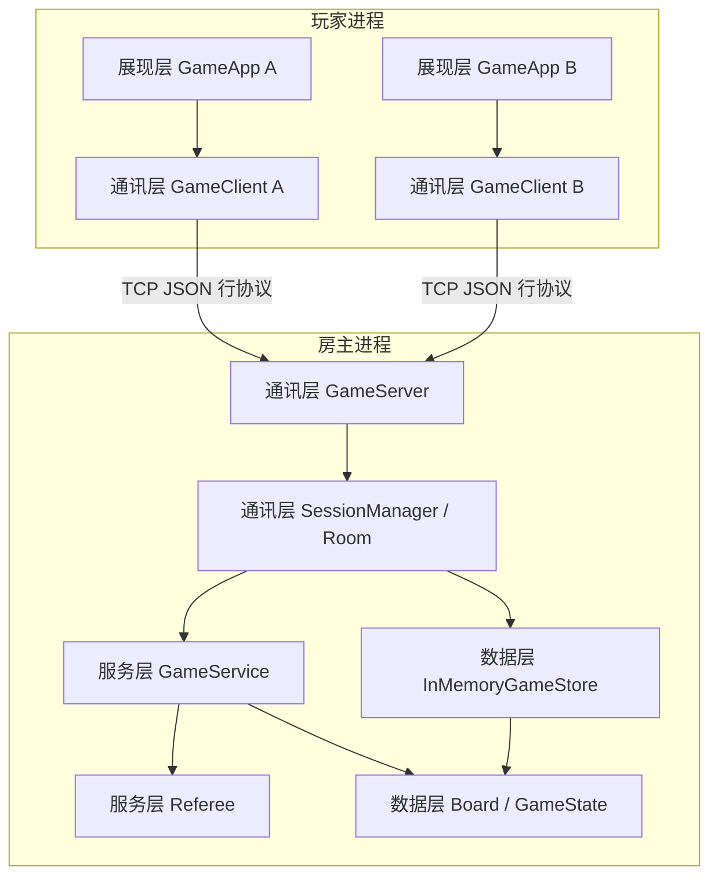
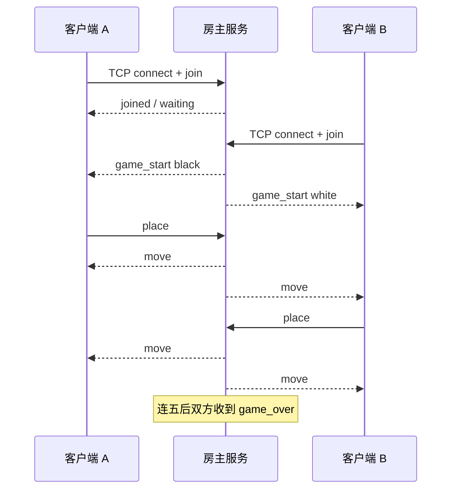

# 系统架构

## 1. 总体结构

系统采用四层架构，依赖方向单向向下：

**展现层 → 通讯层 → 服务层 → 数据层**

房主进程承载通讯层服务端、服务层与数据层；两名玩家的客户端进程承载展现层与通讯层客户端。规则只在房主进程计算一份，避免两台机器各判各的。



## 2. 分层职责

### 2.1 展现层（presentation）

- 技术：Pygame（发行包为 pygame-ce，`import pygame`）
- 模块：`GameApp`、`BoardView`、`Hud`
- 职责：棋盘绘制、鼠标落子、回合/胜负文案
- 约束：不实现胜负规则，只消费 `GameClient.poll()` 的消息

### 2.2 通讯层（communication）

- 技术：asyncio TCP（服务端）+ 阻塞 socket 后台线程（客户端）
- 模块：`Message`、`GameServer`、`SessionManager`、`Room`、`GameClient`
- 职责：连接建立、两人匹配、消息编解码、把合法落子转给服务层并广播结果

### 2.3 服务层（service）

- 模块：`GameService`、`Referee`
- 职责：回合校验、落子合法性、连五检测、和棋结算
- 约束：无 IO、无 Pygame、可单测

### 2.4 数据层（data）

- 模块：`Board`、`Position`、`Stone`、`GameState`、`InMemoryGameStore`
- 职责：保存交叉点占用和对局快照
- 约束：棋盘只存子，不判断输赢（单一职责）

## 3. 运行时进程



## 4. SOLID 对应关系

| 原则 | 体现 |
| --- | --- |
| S 单一职责 | `Board` 只存子，`Referee` 只判规则，`BoardView` 只绘制 |
| O 开闭 | `IGameStore` 可替换为其他存储而无需改 `Room` |
| L 里氏替换 | `InMemoryGameStore` 满足 `IGameStore` 协议 |
| I 接口隔离 | 客户端只暴露 `connect/join/place/poll/close` |
| D 依赖倒置 | 展现层依赖 `GameClient`，服务层依赖 `Referee` 与数据对象，不反向依赖 UI |

## 5. 目录结构

```text
src/gomoku/
  presentation/    展现层
  communication/   通讯层
  service/         服务层
  data/            数据层
  config.py
  exceptions.py
  __main__.py
docs/              产品与架构文档
tests/             规则与联机测试
```
