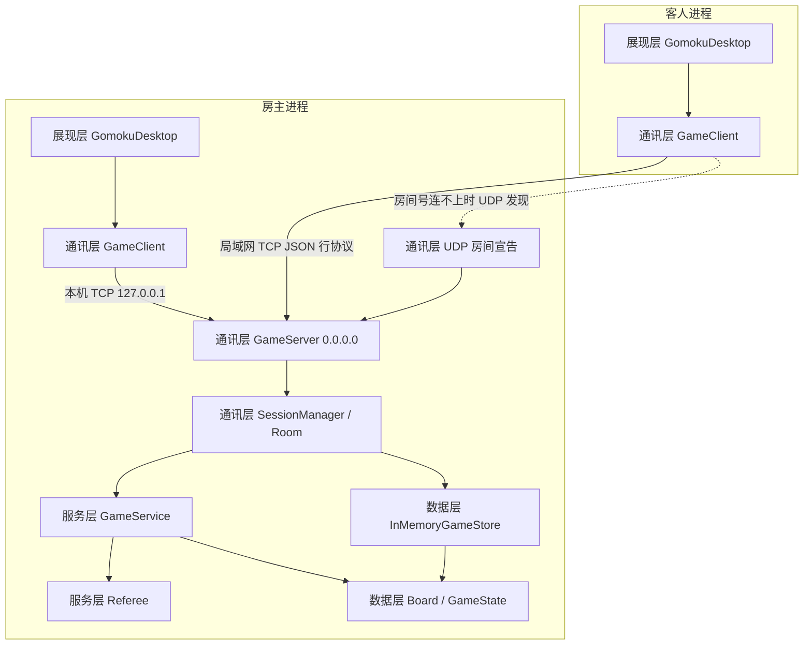
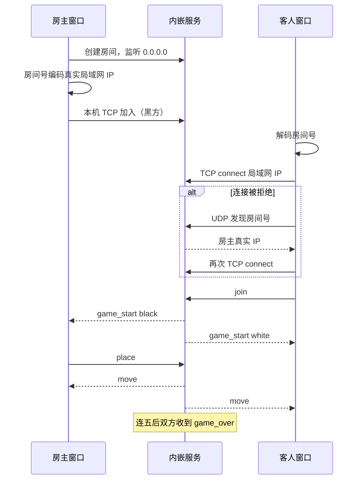

# 系统架构

## 1. 总体结构

系统采用四层架构，依赖方向单向向下：

**展现层 → 通讯层 → 服务层 → 数据层**

创建房间的进程同时承载通讯层服务端、服务层与数据层，以及房主自己的展现层。客人进程只承载展现层与通讯层客户端。规则只在房主进程计算一份，避免两台机器各判各的。



## 2. 分层职责

### 2.1 展现层（presentation）

- 技术：Tkinter 单窗口
- 模块：`GomokuDesktop`、`BoardCanvas`、`theme`
- 职责：大厅、棋盘、聊天侧栏、悔棋/再战确认
- 约束：不实现胜负规则，只消费 `GameClient.poll()` 的消息

### 2.2 通讯层（communication）

- 技术：asyncio TCP（服务端）+ 阻塞 socket 后台线程（客户端）；UDP 宣告为跨机兜底
- 模块：`Message`、`GameServer`、`SessionManager`、`Room`、`GameClient`、`room_code`、`lan`、`discover`、`firewall`
- 职责：
  - 把局域网地址编进房间号（跳过 `127.0.0.1`、`198.18.0.0/15` 等代理虚地址）
  - 监听 `0.0.0.0`，尝试写入 Windows 防火墙规则
  - 连接建立、两人匹配、消息编解码
  - 把合法落子转给服务层并广播结果
- 约束：不判断连五，只转发服务层给出的结果

### 2.3 服务层（service）

- 模块：`GameService`、`Referee`
- 职责：回合校验、落子合法性、连五检测、和棋结算、悔棋恢复、再战重置
- 约束：无 IO、无 Tkinter、可单测

### 2.4 数据层（data）

- 模块：`Board`、`Position`、`Stone`、`GameState`、`InMemoryGameStore`
- 职责：保存交叉点占用和对局快照
- 约束：棋盘只存子，不判断输赢（单一职责）

## 3. 运行时过程



## 4. 跨机连接（10061）

同一台电脑两窗口正常、另一台电脑 `WinError 10061`（目标计算机积极拒绝）时，通常是：

1. 房间号里的 IP 不是机房网卡地址，而是代理 TUN（例如 Clash `198.18.0.1`）。客人去连这个地址，本机或对端没有人在听，立即 RST。
2. 房主进程听在 `0.0.0.0`，但 Windows 防火墙丢掉或拒绝入站 SYN。本机回环不受影响，所以本机自测仍成功。

对应设计：

- `lan.local_ipv4()` 读取 `GetIpAddrTable`，丢掉环回、APIPA、`198.18/15`、CGNAT，优先 RFC1918
- 创建房间时尽量添加防火墙允许规则
- 客人 TCP 失败后用 UDP 按房间号再找一次房主

## 5. SOLID 对应关系

| 原则 | 体现 |
| --- | --- |
| S 单一职责 | `Board` 只存子，`Referee` 只判规则，`BoardCanvas` 只绘制 |
| O 开闭 | `IGameStore` 可替换为其他存储而无需改 `Room` |
| L 里氏替换 | `InMemoryGameStore` 满足 `IGameStore` 协议 |
| I 接口隔离 | 客户端只暴露 `connect/join/place/chat/poll/close` 等 |
| D 依赖倒置 | 展现层依赖 `GameClient`，服务层依赖 `Referee` 与数据对象，不反向依赖 UI |

## 6. 目录结构

```text
src/gomoku/
  presentation/    展现层（Tkinter 桌面）
  communication/   通讯层（协议、房主、房间号、局域网）
  service/         服务层（规则、悔棋、再战）
  data/            数据层（棋盘与快照）
  config.py
  exceptions.py
  __main__.py
docs/              产品、模块、架构、协议
tests/             规则、房间号、局域网地址、联机测试
```
