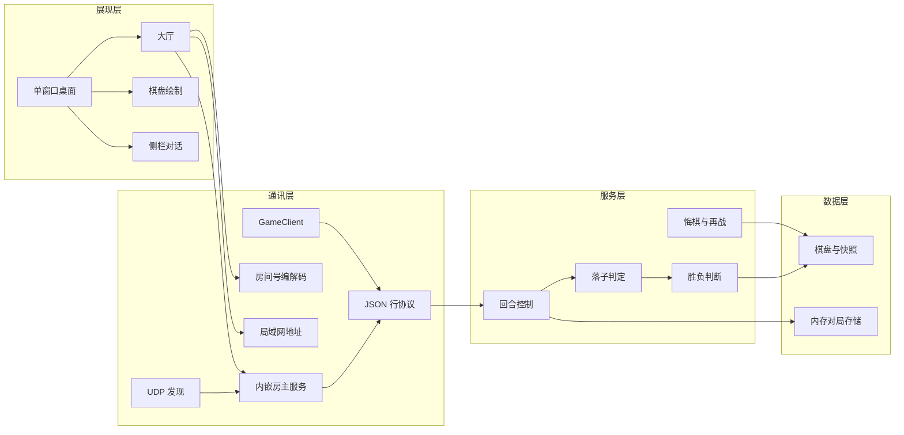

# 功能模块图

## 1. 模块总览

## 2. 模块说明

| 模块 | 位置 | 输入 | 输出 |
| --- | --- | --- | --- |
| 单窗口桌面 | `presentation/desktop.py` | 鼠标、键盘、网络消息 | 大厅/棋盘画面、出站请求 |
| 大厅 | `GomokuDesktop._build_lobby` | 昵称、房间号 | 创建房间或加入 |
| 棋盘绘制 | `presentation/board_canvas.py` | `Board`、最后一手、悬停点 | Tkinter Canvas |
| 侧栏对话 | `GomokuDesktop` 聊天区 | `chat` 消息 | 文本行 |
| 内嵌房主服务 | `communication/server.py` | TCP 连接 | 两人匹配、广播 |
| 房间号编解码 | `communication/room_code.py` | IPv4 + 端口 | 10 位房间号 |
| 局域网地址 | `communication/lan.py` | 本机网卡表 | 可被其他电脑访问的 IPv4 |
| UDP 发现 | `communication/discover.py` | 房间号探测 | 房主真实 IP |
| JSON 行协议 | `communication/messages.py` | 领域结果 | `type + payload` 行 |
| 客户端 | `communication/client.py` | 出站动作 | 入站消息队列 |
| 回合控制 | `GameService.apply_move` | 执子颜色、坐标 | 下一手或终局 |
| 落子判定 | `Referee.validate_move` | 棋盘、坐标 | 通过或 `InvalidMoveError` |
| 胜负判断 | `Referee.winner_from` | 棋盘、最后一手 | 胜者或空 |
| 悔棋与再战 | `GameService.undo_last` / `restart` | 当前快照 | 恢复回合或新棋盘 |
| 棋盘与快照 | `data/board.py` 等 | 落子 | 占用状态 |
| 内存存储 | `InMemoryGameStore` | game_id | `GameState` |
| 对战记录 | `data/records.py` | 终局快照 | 本机 JSON 战绩 |

## 3. 功能到模块映射

| 产品功能 | 主要模块 |
| --- | --- |
| 创建 / 加入房间 | 大厅、房间号、局域网地址、内嵌房主服务 |
| 双人网络联机 | GameClient、JSON 行协议、UDP 发现 |
| 棋盘绘制 | 棋盘绘制、单窗口桌面 |
| 双方轮流下棋 | 落子交互、回合控制 |
| 落子判定 | 落子判定、消息 `invalid` |
| 胜负判断 | 胜负判断、消息 `game_over` |
| 文字对话 | 侧栏对话、消息 `chat` |
| 悔棋 / 再战 | 悔棋与再战、请求-应答消息 |
| 对战记录 | 对战记录、战绩页筛选与棋谱 |
| 防火墙与跨机加入 | 局域网地址过滤、防火墙放行、UDP 发现 |
