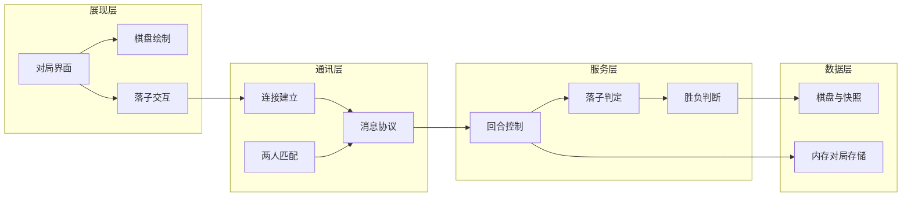

# 功能模块图

## 1. 模块总览

## 2. 模块说明

| 模块 | 位置 | 输入 | 输出 |
| --- | --- | --- | --- |
| 对局界面 | `presentation/app.py` | 网络消息、鼠标事件 | 屏幕画面、place 请求 |
| 棋盘绘制 | `presentation/board_view.py` | `Board`、最后一手、悬停点 | Pygame 绘制 |
| 落子交互 | `GameApp._on_click` | 像素坐标 | 交叉点 `row/col` |
| 连接建立 | `GameClient.connect` / `GameServer` | host、port | TCP 连接 |
| 两人匹配 | `SessionManager` | join 消息 | 黑/白分配、game_start |
| 消息协议 | `communication/messages.py` | 领域结果 | JSON 行 |
| 回合控制 | `GameService.apply_move` | 执子颜色、坐标 | 下一手或终局 |
| 落子判定 | `Referee.validate_move` | 棋盘、坐标 | 通过或 `InvalidMoveError` |
| 胜负判断 | `Referee.winner_from` | 棋盘、最后一手 | 胜者或空 |
| 棋盘与快照 | `data/board.py` 等 | 落子 | 占用状态 |
| 内存存储 | `InMemoryGameStore` | game_id | `GameState` |

## 3. 功能到模块映射

| 产品功能 | 主要模块 |
| --- | --- |
| 双人网络联机 | 连接建立、两人匹配、消息协议 |
| 棋盘绘制 | 棋盘绘制、对局界面 |
| 双方轮流下棋 | 落子交互、回合控制 |
| 落子判定 | 落子判定、消息 `invalid` |
| 胜负判断 | 胜负判断、消息 `game_over` |
| 基础连接与通信 | 连接建立、消息协议 |
